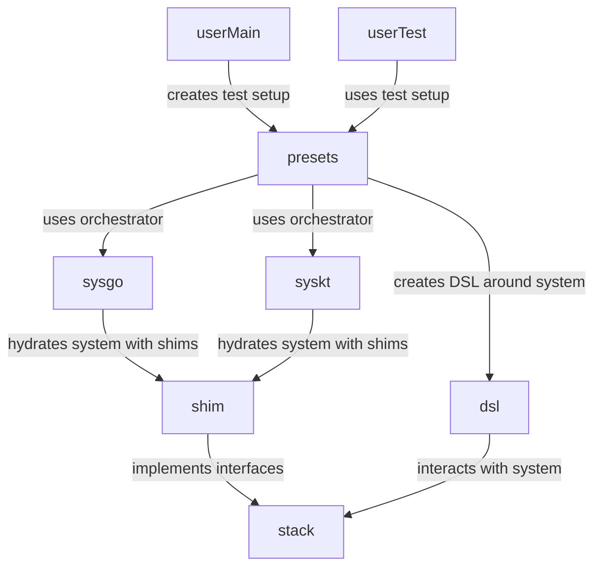

# devstack

## Overview

### Packages

- `devtest`: `T` (test-scope) and `P` (package-scope) test handles.
- `stack`: interfaces, IDs, common typing, core building blocks.
- `shim`: implementations to turn RPC clients / config objects into objects fitting the `stack`.
- `sysgo`: backend, hydrates a `stack.System` with `shim` objects that link to in-process Go services.
- `sysext`: backend, hydrates a `stack.System` with `shim` objects that link to a devnet-descriptor, like Kurtosis-managed services.
- `presets`: provides options that:
  - configure an orchestrator (e.g. validate contents or add new contents)
  - hydrate DSL test setups (e.g. turn a test handle in system with DSL utils)
- `dsl`: makes test-interactions with the `stack` more convenient and readable.




### Patterns

There are some common patterns in this package:

- `stack.X` (interface): presents a component
- `stack.X`-`Kind`: to identify the typing of the component.
- `stack.X`-`ID`: to identify the component. May be a combination of a name and chain-ID, e.g. there may be a default `sequencer` on each L2 chain.
- `shim.X`-`Config`: to provide data when instantiating a default component.
- `shim.New`-`X`: creates a default component (generally a shim, using RPC to wrap around the actual service) to implement an interface.
- `stack.Extensible`-`X` (interface): extension-interface, used during setup to add sub-components to a thing.
  E.g. register and additional batch-submitter to an `ExtensibleL2Network`.

### Components

Available components:

- `System`: a collection of chains and other components
- `Superchain`: a definition of L2s that share protocol rules
- `Cluster`: a definition of an interop dependency set.
- `L1Network`: a L1 chain configuration and registered L1 components
  - `L1ELNode`: L1 execution-layer node, like geth or reth.
  - `L1CLNode`: L1 consensus-layer node. A full beacon node or a mock consensus replacement for testing.
- `L2Network`: a L2 chain configuration and registered L2 components
  - `L2ELNode`: L2 execution-engine, like op-geth or op-reth
  - `L2CLNode`: op-node service, or equivalent
  - `L2Batcher`: op-batcher, or equivalent
  - `L2Proposer`: op-proposer, or equivalent
  - `L2Challenger`: op-challenger, or equivalent
- `Supervisor`: op-supervisor service, or equivalent
- `Faucet`: util to create funded user-accounts
- `User`: util to interact with a chain using an EOA key

### `Orchestrator` interface

The `Orchestrator` is an intentionally minimalist interface.
This is implemented by different external packages, to provide backend-specific functionality,
and focused on creating and maintaining shared resources for tests,

The orchestrator holds on to its own package-level test-handle and logger.
This package-level handle is not like the regular go-test variant, but rather meant for non-test-scoped contexts,
e.g. when running in tools or when running as global orchestrator inside a package-level `TestMain` function.

The global orchestrator is set up with:
```go
var MyTestSetup presets.TestSetup[*MyTestResources]

func TestMain(m *testing.M) {
	presets.DoMain(m, presets.WithMyExampleResources(&MyTestSetup))
}

func TestMain(t *testing.T) {
    resources := MyTestSetup(devtest.NewT(t))
    // resources.Sequencer.DoThing()
}
```

The preferred orchestrator kind is configured with env-var `DEVSTACK_ORCHESTRATOR`:
- `sysgo` instantiates an in-process Go backend, ready to spawn services on demand.
- `syskt` instantiates a kurtosis-descriptor based backend,
  and attaches to a local devnet (selection is configured with kurtosis-devnet env vars).


### `Setup` and `Option`

A `Setup` is a bundle of common inputs (context, logging, testing handle, etc.), and a `System` and `Orchestrator`,
used during creation of services.

An `Option` is a function that takes a `Setup`, and can do one or two things:
- inspect the system, to function as a test-gate.
- enhance the system, to e.g. add missing things to it.

The `System` starts empty, and is then generally filled with new components during setup.

The `Option` may be composed, and is implemented by external packages, that produce objects for the system.
E.g. a kurtosis backend may give an option to iterate over a kurtosis enclave inventory descriptor,
and load handles for all the services into the `System`.

## Design choices

- Interfaces FIRST. Composes much better.
- Incremental system composition.
- Type-safety is important. Internals may be more verbose where needed.
- Everything is a resource and has a typed ID
- Embedding and composition de-dup a lot of code.
- Avoid generics in method signatures, these make composition of the general base types through interfaces much harder.
- Each component has access to commons such as logging and a test handle to assert on.
  - The test-handle is very minimal, so that tooling can implement it, and is only made accessible for internal sanity-check assertions.
- Option pattern for each type, taking the interface, so that the system can be composed by external packages, eg:
  - Kurtosis
  - System like op-e2e
  - Action-test
- Implementations should take `client.RPC` (or equivalent), not raw endpoints. Dialing is best done by the system composer, which can customize retries, in-process RPC pipes, lazy-dialing, etc. as needed.
- The system composer is responsible for tracking raw RPC URLs. These are not portable, and would expose too much low-level detail in the System interface.
- The system compose is responsible for the lifecycle of each component. E.g. kurtosis will keep running, but an in-process system will couple to the test lifecycle and shutdown via `t.Cleanup`.
- Test gates do not have direct access to the `Orchestrator`, since tests may share an orchestrator and should not critically modify what the orchestrator does.
- Orchestrators are shared: assuming a relatively static external kurtosis devnet or live network, the default operation for a package is to run against a single shared system.
- Orchestrators are configured in the `TestMain`, with generic presets, such that the different backends can support the preset or not.
- There are no "chains": the word "chain" is reserved for the protocol typing of the onchain / state-transition related logic. Instead, there are "networks", which include the offchain resources and attached services of a chain.
- Do not abbreviate "client" to "cl", to avoid confusion with "consensus-layer".
